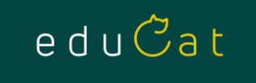

# Materiály pre ZŠ

## Doučovanie do školy

* [Zobrazovanie zlomkov na číselnej osi ](dds/zlomky.py) - program v Pythone
* [Zaokrúhľovanie desatinných čísel](dds/zaokruhlovanie.py) - program v Pythone

## Príprava na Testovanie 9

*  [Zbierka úloh](t9-ps/zbierka/zbierka.pdf)